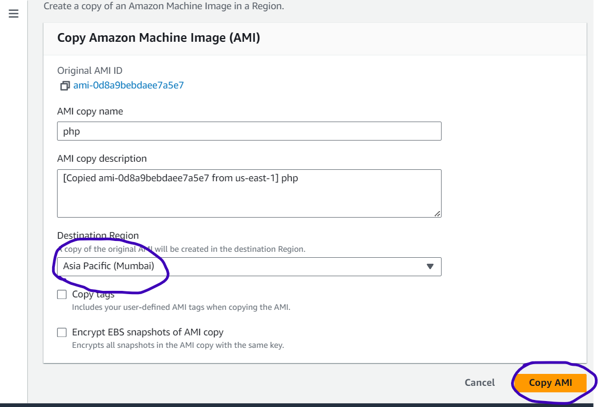
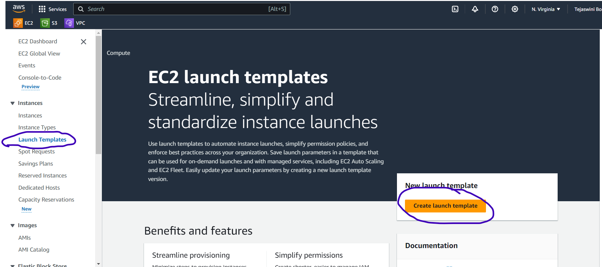
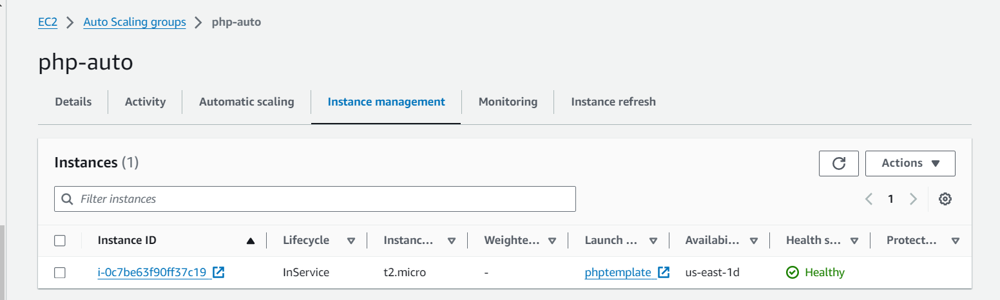

#  Compute
* Compute are the services where we can run applications. In compute services we choose cpu and ram combination.
### Cloud computing Deployment Options
1. Infrasturcture as a service
2. Platform as a service
3. Software as a service
### AWS Compute Services
* EC2: Creates Virtual Machines
* ElasticBeanStalk: This looks like Platform as a Service.
* Batch: High Performance Compute
* Lambda: Serverless
* Containers: ECS, EKS
### How to create resources in AWS
* From Browser (Console)
* From Command Line (AWS CLI)
* From Templates (AWS Cloudformation/Terraform)

### How does AWS EC2 Charge
**1. On-demand:** Create AWS resources any time and delete any time there are no commitments. YOu will be charged for duration of usage.

**2. Reserved instances/savings plan:** Discounts for long term commitments will be offered

**3. Spot Instances:** Auction/bid to make revenue out of unused hardware

### AWS EC2

* EC2 (Elastic Compute Cloud) is an AWS Service to manage virtual machines
* AWS supports
    * Linux
    * Windows
    * mac
    * BSD
* Components of EC2
  * CPU and RAM
        * Instance Size: We select cpu count and RAM size
        * Instance Family: Hardware specifications (Intel/AMD)
        * Purpose: Choose the best size by identifying purpose
  * Storage (Virtual Disk = Elastic Block Storage)
        * Speed and Size: EBS Volume type and Size
        * Where it should exist: EBS volume and Instance Storage
  * OS: Amazon Machine Image

* **Remote Connection:**
* Windows:
    * RDP (Remote Desktop Protocol): RDP helps connecting windows servers using ipaddress & username, password
* Linux:
    * SSH (Secure Shell): SSH helps connection Linux Servers
* **Authentication Types:**
* Password Based Authentication: In AWS Password Based Authentication for ec2 instances is disble by default.
* Key Based Authentication:
    * AWS Uses Private Key and Public Key based on RSA and ED
    * Private key can be downloaded in two formats
       * pem (used by any ssh client)
       * ppk (used by putty based clients)
* Public key is with linux server.
* Private key will be with us.
### What should i do if i lost my key pair
* [refer here](https://zindagitech.com/2-simple-ways-to-recover-a-lost-key-pair-of-aws-linux-ec2-instance/) 
* We can connect through AWS Console connect.
* By using SSM manager
* By creating an user and giving password authentication yes.
* By creating AMI form that instance. We can create another instance using that AMI with new key pair.

* AWS supports two types of block storage (for virtual hard disk storage)
1. Elastic Block Storage:
    * Mounted from a different host in Same AZ
    * This is Persistent Storage (Non Ephemeral)
    * EBS volumes can exist even after ec2 is deleted.
2. Instance Storage
    * Mounted from same host
    * This is volatile Storage (Ephemeral) i.e. shutdown of ec2 will wipe the data adn termination (deletion) of ec2 instance will delete the disks 
* EC2 charges:
    * Charge for instance type
    * Charge for EBS volumes
    * Charge for OS (For some AMIs)
* AWS EC2 mandates all the OS disks should be EBS volumes
* Only few EC2 instance types support instance storage.

### AWS EC2 Lifecycle


### EC2 Instance Types
* Instance Family: This is hardware specification of Host (T, C, M etc) and then they have generations (t1, t2,t3, c1, c5)
* Instance Size: Generally this is a multiplication factor
    * nano
    * micro
    * small
    * medium
    * large
    * xlarge
    * 2xlarge
* Instance size also speaks about networking performance.
* [Instance Types](https://aws.amazon.com/ec2/instance-types/)

### AWS Purchasing Options for EC2
* AWS has following Purchasing Options for EC2. [Refer Here](https://aws.amazon.com/pricing/?nc2=h_ql_pr_ln&aws-products-pricing.sort-by=item.additionalFields.productNameLowercase&aws-products-pricing.sort-order=asc&awsf.Free%20Tier%20Type=*all&awsf.tech-category=*all) for official numbers
1. On demand:
    * We have no commitments with AWS
    * This is the higest priced option and it will be charged
        * per hour
        * per second
    * EC2 pricing will be done only when instance is in running state
2. Spot Instances:
    * We can save costs on under utilized ec2 instance hardwares in aws regions
    * If the demand increases, spot instance will be evicted.
3. Reserved Instances:
    * Here we give 1 year or 3 years commitment to AWS
    * Reserved has two options
        * Standard Reserved Instances
        * Convertible Reserved Instances
    * Payment Options
        * No Upfront
        * Partial Upfront
        * All upfront
* Dedicated Host: We reserve the physical servers and here also we have on-demand and reserved options. 
  
### Options for deploying applications into ec2 instance

**Option-1:**
* Create an ec2 instance, ssh and execute manually:
   * Create an ec2
   * ssh into ec2
   * become root user (sudo -i)
   * Do the following commands.
    ```
    apt update
    apt install apache2 -y
    apt install php libapache2-mod-php php-mysql -y
    echo '<?php phpinfo(); ?>' > /var/www/html/info.php
    systemctl restart apache2
    ``` 
   * Create a reusable image (Amazon Machine Image)
   
   
   
### Instance MetaData Service v1
   * Login into the ec2 instance
   * Instance Metadata service helps in fetching metadata about ec2 instnaces by sending http requests on `169.254.169.254`
   * send a curl request `curl http://169.254.169.254/latest/meta-data/`
  
### Instance Metadata service v2
*  Metadata v2 required a token.
*  While creating ec2 in advanced section metadata version if we select v2 then token is required.
*  When v1 and v2 token is optional.
*  for v2 `TOKEN=`curl -X PUT "http://169.254.169.254/latest/api/token" -H "X-aws-ec2-metadata-token-ttl-seconds: 21600"` \
&& curl -H "X-aws-ec2-metadata-token: $TOKEN" -v http://169.254.169.254/latest/meta-data/`

  
**option-2: User Data**
* In the Advanced section of ec2 instance creation for ubuntu 22 with 80 port opened copy the script into user data and launch instance.
* User Data is the script that gets executed during ec2 creation which is also referred as provisioning.
  
  
   * In advanced setting there will be user data section in that paste thes commands
    ```bash
    #!/bin/bash
    apt update
    apt install apache2 stress -y
    apt install php libapache2-mod-php php-mysql -y
    echo '<?php phpinfo(); ?>' > /var/www/html/info.php
    systemctl restart apache2
    ```
  
   * Now launch the instance.
  
  * Accesing the application over `http://<publicip>/info.php` should give php info page.
  

### Creating an AMI
* AMI id is used to create ec2 instances which is scoped to a Region.
* If we want AMI in multiple regions, we need to copy and this leads to new AMI id.
* Here Icopied image from north virginia to mumbai.




### Horizontal vs Vertical Scaling
* **Differences**

* **Vertical scaling** in AWS is possible by changing instance type.
*  When we change the instance type the ec2 instance should be in stopped state
* Changing instance type in AWS. Shutdown(stop) the ec2 instance.


* Start the instance.
* **Horizontal scaling:**
* This can be done manually by adding ec2 instances with the same AMI.
* Consider the below architecture

* As number of parallel users increase, load on web, orders and catalog increases which might lead to performance bottleneck.
* During the peaks or when in need we need aws to automatically increase number of ec2 instances running the corresponding application.
* It is better to create an AMI for
   * web
   * orders
   * catalog
* AWS has an option to perform auto scaling which is referred as Auto scaling group.

Auto Scaling Groups
-------------------
* AWS EC2 Auto Scaling Groups give us two broader options
    1. fixed scaling:
       * In Fixed scaling the fixed count is maintained by AWS
       * For eg: you have give fixed scaling count to 5, it creates 5 ec2 instances in chosen subnets (AZ’s). By any chance if the ec2 instance is down, aws will create one more to maintain count of 5
    2. auto scaling:
        * In this case we specify
           * min ec2 instances
           * max ec2 instances
           * desired count
        * We also specify when the ec2 instance count should be increased (scaled out) and decrease (scaled in)
        * desired count will be dynamic depending on situation.
### To Create Autoscaling group
* AMI: Create AMI with Applications pre installed
* Decide which metrics to use when your ec2 has to be scaled out or in
* Choose the AZ’s (subnets) where scaling has to happned
* Choose the scaling methodologies

### Experiments
* Create an ec2 instance with phpinfo and stress
```bash
#!/bin/bash
apt update
apt install apache2 stress -y
apt install php libapache2-mod-php php-mysql -y
echo '<?php phpinfo(); ?>' > /var/www/html/info.php
systemctl restart apache2
```
* Navigate to monitoring on AWS Console

* ssh into ec2 and execute
```
stress --cpu 10 --io 40 --vm-bytes 256M --timeout 10m -v
```
* observe the metrics on the AWS Console for next 10 minutes

* Instance will not support as it reached 80% of cpu is utilizing it will misbehaving.
* Generally in servers like apache the load on cpu increases as number of requests to websit increases, so cpu utilization should be a decent metric to start scaling
* Before creating auto sacling groups we have to create a launch template.

### Launch Template
* This is a template to launch ec2 where certain parameters can be dynamic or static.
* Ensure you an ami with php info and stress installed.
* Create a Launch Template
 
 
* Select the ami to which you want to create.
 
* Select the instance type, keypair, security group
 
 
 
* After creating the template we can create a versions so that we change the versions while we creating the insatnce.
 
* Now launch an insatnce using the launch template.
 
 
 
 
* After creating a launch template, create auto sacling group.
 
* Select the launch template and version.
 
* Select the network and the availabilityzones.
 
 
 
 
 
 
 
 
 
 
 
* In load balancer take the dns of thatand check if the application is running or that
 
 
* Now login into the instance and stress the cpu. Now check the cpu utilization of that instance. Next check the auto scaling group insatnce management,it will create other one. 
 
 
* After the stress proccess is done cpu utilization is reduced then scaling in will be automatically which means intances will will be maintained desired state.
  

AWS Autoscaling Policies
------------------------
* Target Tracking Policy: This tries to maintain the percentage defined. To maintain the metric defined aws will perform scale out and in.
* In the below scaling policies we define when to scale out and when to scale in. Refer Here for official docs
* Step Scaling:
* Simple Scaling: Simple Scaling has an extra cooldown period during which scaling will not happen rest is same as step scaling.
* Create an autoscaling group withouth selecting scaling policy.
  
  
  
  
  
  
  
  
  
  
  
  
* Now create the above same things for scale in step policy.
  
  

Questions to be addressed
-------------------------
* How do i upgrade the images without downtime when there is a new version of the image application/os upgrade
* Create a new version of the launch template
* Navigate to asg and perform instance refresh
Exercise:
Create a launch template with ubuntu and in userdata install apache
Create a autoscaling with load balancer
Now after everything is running
Create a new version of the launch template where in userdata install nginx
Perform instance refresh of asg and wait for the nginx to be updated.